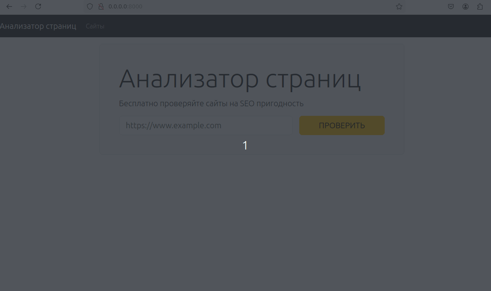

### Hexlet tests and linter status:
[](https://github.com/MaksimGoryachev/python-project-83/actions)
[](https://github.com/MaksimGoryachev/python-project-83/actions)
[](https://codeclimate.com/github/MaksimGoryachev/python-project-83/maintainability)

---
## Description

[Page Analyzer](https://python-project-83-r9xq.onrender.com) is a website that analyzes specified pages for SEO suitability.



---
## Instalation

You must have python 3.12 and newer, poetry and postgresql installed to work properly

### Repository cloning
Clone the repository to your computer `git clone https://github.com/MaksimGoryachev/python-project-83`

### Database creation
```sh
whoami
{username}
sudo -u postgres createuser --createdb {username} 
createdb {databasename}
```
### Secret keys
Two environment variables are required for the site to work: SECRET_KEY and DATABASE_URL. To define and store them, you can create a .env file in the project:

.env
```sh
DATABASE_URL='postgresql://{username}:{password}@{host}:{port}/{databasename}'
SECRET_KEY='{your secret key}'
```
### Installing dependencies
Install the package `make setup`

---

## Start the app on the local dev server
'make dev'

---
## Start the app on the production server
'make start'

---